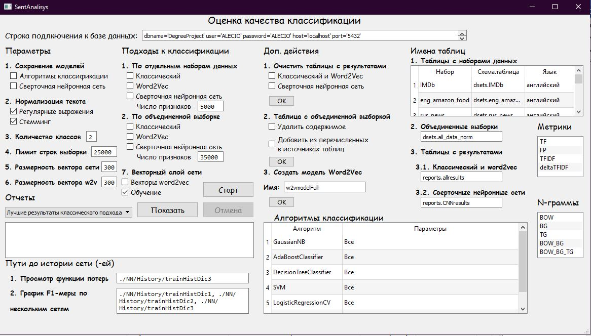

# Machine learning
### АНАЛИЗ ТОНАЛЬНОСТИ ТЕКСТОВ С ИСПОЛЬЗОВАНИЕМ КЛАССИФИКАТОРОВ НА ОСНОВЕ МЕТОДОВ МАШИННОГО ОБУЧЕНИЯ
Многопоточное оконное приложение для оценки качества решения задачи анализа тональности текстов
* #### Общий вид
  
* #### Обратная связь
  
* #### Выбор отчетов
  
* #### Пример отчетов
  
